# 🚀 Project Title

Title: SignLabs

---

Tagline: Breaking the communication barrier

## 🎯 Objective

To create an AI-based solution that converts spoken language to real-time Indian Sign Language using virtual avatars.

Helps bridge the communication gap between hearing and non-hearing individuals.

---

## 🛠️ Tech Stack

### Core Technologies Used:
Blender: Avatar creation and animation.
Python: Backend processing and integration.
OpenCV: For video processing.
MediaPipe: Hand and body pose detection.
Google Text-to-Speech: For spoken word generation.
Speech Recognition API: To convert voice to text
Gemini Api: To translate to regional languages

---

## Technical FLow Diagram

```mermaid
%%{init: {'theme': 'base', 'themeVariables': { 'primaryColor': '#007bff', 'edgeLabelBackground':'#ffffff', 'tertiaryColor': '#f4f4f4'}}}%%
graph LR
    subgraph Input Layer
        A[🎙️ User Voice / Audio] --> B(Speech Recognition API);
    end

    subgraph Processing Core
        B -->|Raw Text| C{🐍 Python Backend};
        C -->|Text for Translation| D[✨ Gemini API];
        D -->|Translated Text| C;
        C -- ISL Grammar Logic --> E[Converting Eng/Hindi to ISL Gloss];
    end

    subgraph Animation Engine
        E -->|Pose & Animation Data| F[🎥 Blender Real-time Engine];
        F -- Rendering Avatar --> G(Lifelike Avatar Model);
    end

    subgraph Output Layer
        G -->|Video Stream| H[🖥️ Final UI Display];
    end

    style A fill:#f9f,stroke:#333,stroke-width:2px
    style H fill:#9f9,stroke:#333,stroke-width:2px
    style F fill:#ffcb77,stroke:#333,stroke-width:2px
```

---

## ✨ Key Features

Highlight the most important features of your project:

✅ Real-time Voice to Sign Conversion
Converts spoken input into Indian Sign Language instantly using expressive animated avatars.

✅ Lifelike Avatar Animations
Our avatars don’t just sign—they move naturally, making communication feel more human and engaging.

✅ Supports Both Live & Pre-recorded Input
Whether it's a live class, a recorded lecture, or a video message—SignLapse can translate it all.

✅ Built for Inclusivity
Designed with a focus on accessibility, this tool helps deaf and hard-of-hearing users fully engage in peer learning and mentorship.

✅ Modular & Scalable
Can be integrated into platforms like Google Meet, Zoom, or educational portals with ease.

✅ Optimized for Indian Sign Language (ISL)
Specifically tailored for ISL, respecting its unique grammar and flow, unlike generic ASL-based tools. 

Add images, GIFs, or screenshots if helpful!

---

## 📽️ Demo & Deliverables

- Demo Video: https://www.youtube.com/watch?v=7f2GxtRaQvI
- Pitch Deck / PPT Link: https://docs.google.com/presentation/d/15z6ZQscn0ZWWEUuOSys46d4hvjj2FuOD/edit?usp=sharing&ouid=106877923158026485472&rtpof=true&sd=true  

---

## 🧪 How to Run the Project

### Requirements:
Python 3.8+
Git
ffmpeg (for audio processing)
Google Colab (for model inference if not running locally)
Basic system with GPU (optional but recommended)
Internet connection (for speech-to-text API)

---

## 🧬 Future Scope

We’re just scratching the surface with SignLapse—there’s so much more we’re excited to build:

1. Multilingual Sign Support
Expanding beyond Indian Sign Language to include ASL, BSL, and regional variants, making it a global tool for inclusivity.

2. Real-Time Two-Way Communication
Adding the ability to convert sign language back into text or speech, enabling smoother conversations between deaf and hearing users.

3. Smarter Gesture Prediction
Using more advanced AI to understand context, emotions, and sentence flow for even more natural avatar movements.

4. Mobile & Web Integration
Bringing SignLapse to phones, tablets, and browsers so it’s always accessible—anytime, anywhere.

5. Plug-and-Play for Platforms
Easy integration with platforms like Google Meet, Zoom, and learning management systems to break down communication barriers in real-time.

6. Learning Mode for ISL
A feature to help users actually learn Indian Sign Language using interactive avatars—fun and functional!

---

## 🏁 Final Words

Building SignLabs wasn’t just about code—it was about connection.

SignLapse started as an idea, but turned into something way more meaningful. We weren’t just building tech—we were building a voice for those often unheard.
From endless bugs to "aha!" moments, this journey was challenging, fun, and deeply fulfilling.
We’re proud of what we created, and even more excited about where it can go next. This is just the beginning.

---
